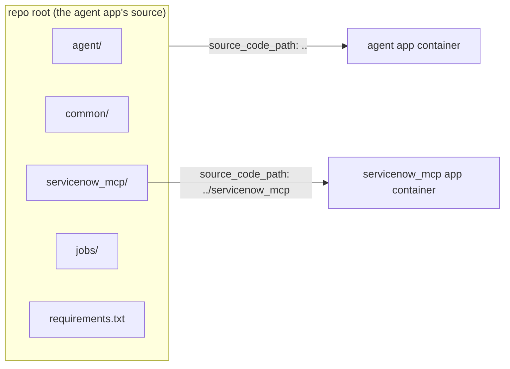
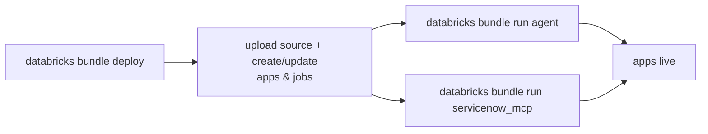
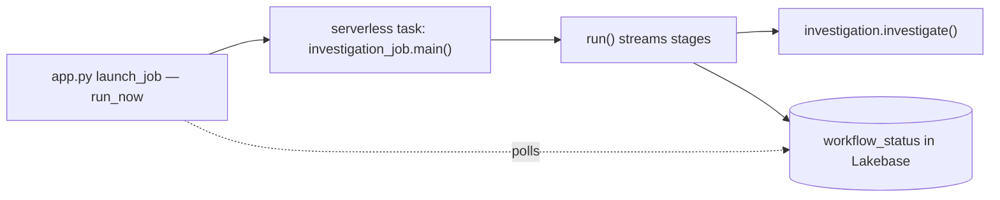

# 01 · Setup — What You Provision Around the Agent

This section covers everything that exists *around* the agent and has to be set
up for it to run: **the bundle** that packages and ships the whole system, **the
jobs** the agent triggers, and **the prerequisites** an admin provisions (Lakebase
tables and grants). None of this is the agent's own logic — it's the ground it
stands on.

---

# Part A — The Declarative Automation Bundle

Everything in this project — two apps and three jobs — is defined by a single
**[Declarative Automation Bundle (DAB)](https://docs.databricks.com/aws/en/dev-tools/bundles)** and deployed with one command.

## What a Declarative Automation Bundle is

A DAB is an infrastructure-as-code description of Databricks resources (apps,
jobs, pipelines, …) plus the deployment settings for one or more target
environments. You describe *what* should exist in YAML; `databricks bundle
deploy` reconciles the workspace to match. The benefit: the entire deployable
system lives in version control, and any environment can be recreated from it.

This project's bundle has three parts:

1. **`databricks.yml`** — the bundle root: its name, what to include, what to
   sync, and the target environment(s).
2. **`resources/apps.yml`** — the two Databricks Apps.
3. **`resources/jobs.yml`** — the three Databricks Jobs.

`databricks.yml` pulls the resource files in with `include: [resources/*.yml]`.

## `databricks.yml` — the bundle root

Read it top to bottom; every line earns its place:

- **`bundle.name`** — the bundle's identifier in the workspace. (Workspace-
  specific; you'd rename it for your own deployment.)
- **`sync.exclude`** — the source tree is uploaded to the workspace on deploy,
  so this list keeps heavyweight and non-runtime directories *out* of the
  upload: `.venv`, `.git`, caches, `docs/`, `tests/`, `*.md`, `uv.lock`. This
  matters because (as you'll see next) the *whole repo* is the app source, and
  you don't want to ship the virtualenv or the test suite into the app
  container.
- **`targets.dev`** — the one target, marked `default: true`, so commands need
  no `-t` flag. Two settings inside it are load-bearing:
  - **`mode: development`** with **`presets.name_prefix: ""`**. Development mode
    normally prefixes every resource name with `[dev your.name]` to keep
    engineers' deployments from colliding. That prefix would violate the strict
    naming rules for Databricks Apps, so it's explicitly blanked — the apps and
    jobs keep the exact names written in the resource files.
  - **`workspace.profile`** — pins which Databricks CLI auth profile the bundle
    deploys with, so a deploy always targets the intended workspace.

## The one deployment decision that shapes everything: deploy from the repo root

Both apps set their source directory, and the choice is deliberate:



- The **agent app** uses `source_code_path: ..` — the **repo root**. That means
  `agent`, `common`, `servicenow_mcp`, and `jobs` are all uploaded together as
  sibling packages, so imports like `from common.lakebase import ...` resolve
  inside the container.
- The **servicenow_mcp app** uses its own nested directory
  (`source_code_path: ../servicenow_mcp`) because it's a self-contained stub and
  two apps may not share a source path.

**Consequence for dependencies:** a Databricks App resolves its Python
dependencies from the files *at the root of its source path*. So:

| App | Source path | Installs from |
|-----|-------------|---------------|
| `agent` | repo root (`..`) | **`requirements.txt`** (root) |
| `servicenow_mcp` | `../servicenow_mcp` | **`servicenow_mcp/requirements.txt`** |

The root `requirements.txt` is therefore the *union* of everything the agent app
needs at runtime — FastAPI/uvicorn/pydantic, LangGraph + the Postgres
checkpointer, `psycopg`, the Databricks SDK, the MCP client, `databricks-langchain`
+ LangChain, and MLflow. The MCP app's `requirements.txt` is tiny by comparison —
just `mcp` and `httpx`.

### pip vs. uv for the apps

Databricks Apps support **two** ways to manage Python dependencies, and the
runtime picks one automatically from the files at the root of the app's source
path:

| Mode | Trigger files | Pre-installed libraries | Reproducibility |
|------|---------------|-------------------------|-----------------|
| **pip** | `requirements.txt` present | Included (fastapi, uvicorn, databricks-sdk, …) — you list only what you add | Pin exact versions yourself (`==`) |
| **uv** | `pyproject.toml` **+** `uv.lock`, no `requirements.txt` | **None** — declare every dependency | Fully pinned by the committed `uv.lock` |

**Precedence:** if `requirements.txt` exists it wins, and pip is used regardless
of whether `pyproject.toml` is also present.

**Both are fully supported — pick whichever your team prefers.** This repository
uses **pip with a pinned `requirements.txt`**: the dependency list stays short
(it inherits the runtime's pre-installed FastAPI/uvicorn), and it's still
reproducible because every direct dependency is pinned to an exact version
(`==`). If you prefer uv's lockfile workflow, switch by adding a `pyproject.toml`
+ `uv.lock` (declaring *all* dependencies, since uv apps get none pre-installed),
removing `requirements.txt`, and making sure `uv.lock` is **not** excluded from
the bundle's file sync so the lockfile ships with the app.

#### What's pre-installed (and what isn't)

In pip mode the runtime ships a base image with the supported web frameworks and
the Databricks SDK already installed, so a pip app lists only what it *adds*.
Databricks doesn't publish an exhaustive versioned manifest, but the documented
pre-installed set includes **FastAPI, uvicorn, Flask, Dash, Streamlit, Gradio,
Shiny** (plus their transitive deps — so `pydantic` and `starlette` come along)
and the **`databricks-sdk`**. uv mode ships none of these; you declare
everything. Here's how that lands for this project's dependencies:

| Dependency | Pre-installed (pip)? | Must be declared |
|---|---|---|
| `fastapi`, `uvicorn`, `pydantic`, `databricks-sdk` | ✅ yes | only under uv |
| `langgraph`, `langgraph-checkpoint-postgres`, `langchain`, `langchain-core`, `databricks-langchain` | ❌ no | pip **and** uv |
| `psycopg[binary]` | ❌ no | pip **and** uv |
| `mcp`, `httpx`, `mlflow` | ❌ no | pip **and** uv |

So most of `requirements.txt` is the "not pre-installed" rows — required either
way; the pre-installed rows are the *only* extra burden uv adds. Two caveats:

- **Pre-installed ≠ the version you get.** This repo pins `fastapi==0.141.1`,
  newer than the base image's FastAPI, and pip upgrades it from public PyPI —
  listing a pre-installed package is precisely how you pin or override it.
- **The published list isn't exhaustive.** The definitive way to see what's
  actually in the environment is to inspect a running app (e.g. a `pip freeze`
  from inside it).

> **Note for Databricks employees:** on internal Databricks workspaces, uv's
> package installs route through an internal PyPI proxy that Apps can't reach,
> so deploys there should stay on pip. Customer workspaces are unaffected and
> can use uv freely — this is the only reason this repo pins with pip rather
> than a `uv.lock`.

uv is genuinely useful even when you deploy with pip — use it to *resolve* the
exact pins for `requirements.txt`:

```bash
uv pip compile requirements.txt --python-version 3.11 -o /tmp/pinned.txt
```

then copy the resolved direct-dependency versions into `requirements.txt`. And
uv is the **local-development** tool here regardless (`pyproject.toml` +
`uv.lock`), independent of how the apps deploy.

The jobs are separate again: they declare their two dependencies inline in a
serverless environment spec (Part B), the native serverless-compute mechanism.

## `resources/apps.yml` — the two apps

Each app entry has a `name`, a `source_code_path`, an optional `resources` list
(Databricks resources to attach), `user_api_scopes` (on-behalf-of scopes), and a
`config` block (`command` + `env`).

### The `agent` app

- **`command`** — `uvicorn agent.app:app --host 0.0.0.0 --port 8000`. This is the
  entry point — it boots the FastAPI `app` object defined in `agent/app.py`.
- **`user_api_scopes: [ai-gateway, sql]`** — declares which scopes the app may
  request *on behalf of the signed-in user*. `sql` lets it query the warehouse
  as the user; `ai-gateway` covers model/MCP calls. ([Identity &
  passthrough](04-identity-and-passthrough.md) is all about how this
  on-behalf-of flow works — and its limits.)
- **`resources.postgres`** — attaches Lakebase. Attaching it injects the
  connection environment variables (`PGHOST`, `PGUSER`, `PGDATABASE`, `PGPORT`)
  into the container automatically; the app fetches the short-lived password
  itself at request time (see [state & memory](02-llm-agent.md)).
  `permission: CAN_CONNECT_AND_CREATE`.
- **`env`** — the app's configuration knobs:

| Env var | Purpose |
|---------|---------|
| `WAREHOUSE_ID` | SQL warehouse used for the auth-event query |
| `AUTH_TABLE` | Unity Catalog table of auth events to investigate |
| `LAKEBASE_ENDPOINT` | Lakebase endpoint path, used to mint DB credentials |
| `SERVICENOW_MCP_URL` | URL of the deployed MCP app (the second app) |
| `MLFLOW_EXPERIMENT` | Workspace experiment path for agent traces |

### The `servicenow_mcp` app

Much smaller: `command: ["python", "server.py"]`, and env vars that tell the
FastMCP server to use the stub backend and bind `0.0.0.0` on the Apps port. The
server itself is covered in [Identity &
passthrough](04-identity-and-passthrough.md).

## `resources/jobs.yml` — the three jobs

All three are **serverless** [Lakeflow Jobs](https://docs.databricks.com/aws/en/jobs) `spark_python_task`s (a Python file run on
serverless compute, environment version 3, with `psycopg` + the Databricks SDK
as dependencies). They differ in purpose and triggering:

| Job | Name | Trigger | Notes |
|-----|------|---------|-------|
| `investigation_job` | investigation | `run_now` from the app | `max_concurrent_runs: 10`, queue enabled — many users can investigate at once |
| `failure_demo_job` | failure demo | `run_now` from the app | Deliberately fails, to exercise the diagnosis path |
| `sweeper_job` | sweeper | **Scheduled** (every 15 min) | Marks abandoned conversation turns on a schedule (Part B) |

The app never hard-codes these jobs' ids. It looks them up by `job_key` in the
governed registry table at runtime (see [the job registry](02-llm-agent.md)) —
the resource files here just *create* the jobs; the registry *maps names to
their ids*.

## Where the truth lives: bundle config vs. standalone `app.yaml`

You'll notice each app directory also contains an `app.yaml`
(`agent/app.yaml`, `servicenow_mcp/app.yaml`). A standalone Databricks App
normally reads its `command`/`env` from that file. **In this project the bundle
supplies the `config:` block, so the bundle is the source of truth** — the
deployed apps do not read these `app.yaml` files, and their contents don't match
the bundle (e.g. `servicenow_mcp/app.yaml` lists a different `command`). To
change how an app runs, edit `resources/apps.yml`.

`.env.example` is a local-dev convenience and doesn't fully match the deployed
app (e.g. it lists `INVESTIGATION_JOB_ID`, which the app doesn't read — job ids
come from the registry).

## The deploy workflow



```bash
# validate first (strict catches schema issues)
databricks bundle validate --strict -t dev --profile <your-profile>

# deploy the whole bundle (both apps + three jobs)
databricks bundle deploy -t dev --profile <your-profile>

# start each app
databricks bundle run agent --profile <your-profile>
databricks bundle run servicenow_mcp --profile <your-profile>
```

Local development uses `uv`: `uv sync` installs from `pyproject.toml` (resolving
against `uv.lock`), and `uv run pytest -q` runs the offline test suite. In this
repo there's a split — **uv for local dev, pinned `requirements.txt` for the
deployed apps** (see the pip-vs-uv note above for why) — so keep the two in rough
agreement by resolving the app pins with `uv pip compile`. A customer deployment
could instead use uv end to end.

---

# Part B — The jobs the agent triggers

The registry resolves a `job_key` to a Databricks job; this part is what those
jobs actually *do* — and the analysis logic they share. The split is worth
holding onto:

- **`agent/investigation.py`** — the reusable, testable investigation logic. No
  serverless or Databricks-runtime assumptions; it takes its SQL executor as a
  parameter.
- **`jobs/*.py`** — thin serverless entrypoints (`spark_python_task` scripts)
  that the app triggers. They wire up identity/config and call the logic.



## `agent/investigation.py` — the analysis logic

### The query

`SUSPICIOUS_LOGINS_SQL` looks for off-hours (00:00–05:00), non-corporate-ASN
logins against a host, grouped by ASN / user / event type. Two things about how
it's built:

- **`:host` is a bound parameter**, not string-interpolated — injection-safe.
- **`{table}` is interpolated**, but only from trusted config (the `AUTH_TABLE`
  env var, never user input).

### Dependency injection: one logic, swappable identity

The pivotal design choice is that `query_suspicious_logins` takes an
`execute_sql` *function* rather than opening its own connection:

```python
def query_suspicious_logins(host, *, table, execute_sql) -> list[dict]:
    return execute_sql(SUSPICIOUS_LOGINS_SQL.format(table=table), {"host": host})
```

`sdk_sql_executor(workspace_client, warehouse_id)` builds such a function backed
by the Databricks SQL Statement Execution API. Because the executor is injected,
**the same analysis runs under two different identities**:

- In the **app** (`obo_investigate`, [Identity &
  passthrough](04-identity-and-passthrough.md)), the executor is built from the
  *user's* forwarded token — the query runs **as the user**, Unity
  Catalog-enforced, to produce the instant finding line in the chat reply.
- In the **job** (`investigation_job`), the executor is built from the app
  *service principal's* client — the query runs **as the SP**, and its result is
  streamed to Lakebase and drives the incident.

Same function, two callers, two identities. (It's also trivially testable — pass
a fake `execute_sql` that returns canned rows.)

### From rows to findings

- **`build_findings_from_rows(host, rows)`** turns grouped rows into a `Findings`
  object (summary, severity, indicators). Severity is rule-based: a successful
  login after ≥10 failures → `high`; any success → `medium`; otherwise `low`;
  no rows → a "nothing found", `low` finding.
- **`investigate(host, execute_sql=None, table=None)`** is the entry point: it
  runs the real query when both `execute_sql` and `table` are supplied, and
  otherwise falls back to `stages.build_findings(host)` — a mock finding — so the
  logic is runnable offline with no warehouse.

## `jobs/investigation_job.py` — the real workload

This is the `spark_python_task` the `investigation` workflow points at.

### The packaging shim

The file opens with `_ensure_repo_root_on_path()`. In the serverless execution
kernel, `__file__` may be undefined, so it walks `cwd` / `sys.path` looking for
the directory that contains both `agent/` and `common/`, and puts it on the path.
This is the runtime counterpart to the "deploy from the repo root" decision in
Part A: the whole repo is synced next to the job, and this shim makes the sibling
packages importable.

### `run()` — streaming the stages

`run()` iterates the ordered stage list from `investigation_stages()`
(`running: correlating…` → `enriching…` → `scoring…` → `complete`) and, for each,
**upserts a `WorkflowStatus` row** to Lakebase keyed by `run_id`, sleeping
`delay` seconds between the non-final stages. That sleep is what makes the job a
believable long-running workflow the UI can poll. On the `complete` stage it
calls `investigate(...)` and stores the resulting findings on the row. The app's
`check_status` ([the orchestrator app](03-orchestrator-app.md)) reads exactly
these rows.

`run()` is invoked two ways: as the serverless entrypoint via `main()`, and — in
local dev, when `launch_job` gets no `job_id` — directly in a daemon thread
inside the app (`app.py`).

### `main()` — parameters as argv, not env

`main()` parses its inputs with `argparse` from the **CLI argv** the app passes as
`python_params` in `run_now` (`--run-id`, `--thread-id`, `--user-id`, `--host`,
`--delay`, `--warehouse-id`, `--auth-table`). Serverless tasks can't have
arbitrary env vars set on them, so argv is the parameter channel (there's an
env-var fallback for local/manual runs). If `--warehouse-id` and `--auth-table`
are present, it builds the SP `execute_sql` and runs the real query; otherwise
the mock fallback applies. It opens its own Lakebase connection
(`common.lakebase.connect`) for the status writes.

## `jobs/failure_demo_job.py` — a job that fails on purpose

The `failure_demo` workflow points here. Its entire job is to fail with a
realistic error:

```python
def run(*args, **kwargs):
    raise RuntimeError("AnalysisException: [TABLE_OR_VIEW_NOT_FOUND] … auth_events_stg")
```

Two deliberate choices:

- **It touches nothing else** — no Lakebase write, no `psycopg` import. Importing
  the native Postgres driver just to record a status was crashing the serverless
  kernel, which polluted the very error log the diagnosis reads. Keeping the job
  bare means the run's error log contains only this clean Spark/Unity Catalog
  error.
- **The app detects the failure via the Jobs API** (`_databricks_result_state`)
  and diagnoses from the run's error log (see [failure
  diagnosis](02-llm-agent.md)). The job doesn't self-report; it just fails
  cleanly.

`run(*args, **kwargs)` accepts and ignores any launch args, so it's
call-compatible with the same `python_params` the app sends every job.

## `jobs/sweeper_job.py` — the scheduled turn-sweeper

A scheduled job (every 15 minutes) that marks **abandoned conversation turns** —
turns that started but never finished (e.g. the request crashed or the browser
went away mid-turn). It's an observability signal, separate from request handling.

- **`abandoned_turn_ids(turns, now, ttl_seconds)`** is a pure function: of the
  `open` turns, it returns those older than the TTL.
- **`main()`** reads the `open` rows from the Lakebase `turns` table and flips the
  stale ones to `abandoned`. The TTL defaults to 900 s (`TURN_TTL_SECONDS`), which
  matches the 15-minute cadence.

**What writes the `turns` table.** The orchestrator's `/chat` records the turn
lifecycle through the status store's `open_turn` / `close_turn`
([orchestrator app](03-orchestrator-app.md)): it inserts an `open` row when a typed
turn starts and flips it to `closed` when the request finishes — whether the agent
succeeds or returns a graceful error. A request that *never* returns (a crash, a
timeout kill) leaves its row `open`, and the sweeper marks it `abandoned` once it's
older than the TTL. The 900 s TTL sits well above the Apps **120-second request
cap**, so a live in-flight request can't outlive it and be swept by mistake — a
still-`open` turn always means a request that ended without returning. Turn writes
are best-effort: a failed write is rolled back and logged (never raised), so the
chat turn still proceeds, and the silent background status poller is not a turn, so
it never writes here. (Short-term conversational *memory* is a different thing,
handled by the checkpointer — see [state & memory](02-llm-agent.md).)

> **Prerequisites.** The `turns` table is created by `lakebase/schema.sql` and is
> app-writable: the app SP needs `INSERT`/`UPDATE`/`SELECT` on it, and the sweeper
> (which runs as the SP) needs `SELECT`/`UPDATE`.

## A note on scale and identity

The investigation is a **bounded-result** query — it scans the auth table and
returns a handful of grouped rows, which is exactly what the SQL-warehouse
executor is for (`execute_statement` pulls the rows back to the caller). A
genuinely **large** workload (long-running ETL that reads and writes lots of
data) belongs *inside* the job instead: a `spark_python_task` has a live
`SparkSession`, so `spark.sql(...)` / DataFrame work runs on the job's serverless
compute and writes to Delta rather than returning a result set. The
submit → poll → finish orchestration wouldn't change — only the job's internals
would. In this demo the long-running feel is simulated with `time.sleep` between
stages, not real heavy compute.

The catch is **identity**: the warehouse query can run **as the user** (OBO,
Unity Catalog-enforced), but a serverless job runs **as the app service
principal**. So "run as the user" points at the warehouse path and "run heavy
processing" points at the job path — a tension covered in [Identity &
passthrough](04-identity-and-passthrough.md).

---

# Part C — Prerequisites you provision

The bundle creates the apps and jobs, but **not** the Lakebase tables or the
service-principal grants. Before the app works in a new environment, an admin
must set these up (per environment):

- Create the Lakebase **`workflow_status`** (and **`turns`**) tables (`lakebase/schema.sql`).
- Create and seed the admin-owned **`agent_config.jobs`** registry table with each
  workflow's **workspace-specific** `job_id` — the app service principal gets
  `SELECT` only, so it can't rewrite its own allowlist (see [the job
  registry](02-llm-agent.md)).
- Create and seed the Unity Catalog **`auth_events`** table (your `AUTH_TABLE`) — the
  login-event data the agent queries **as the calling user** (OBO). It is **not** created
  by the bundle or any script in this repo; DDL + demo rows are below.
- Grant the app's **service principal**: `CAN_MANAGE_RUN` on each job, `CAN_USE`
  on the MCP app, DML on `workflow_status`/`turns`, `CAN_EDIT` on the MLflow
  experiment, and `EXECUTE` on the `system.ai.claude-sonnet-5` model service (the LLM
  routes through Unity AI Gateway). Grant end **users** `SELECT` on `auth_events`
  (the auth query runs as them, UC-enforced).

**Recreating an app mints a new service principal**, so all grants above must be
re-applied to it.

## Create and seed the `auth_events` table (Unity Catalog)

The investigation reads a login-event table — `AUTH_TABLE` (default
`main.job_agent_demo.auth_events`). **Nothing in this repo creates or seeds it**;
provide it yourself. This schema matches what `agent/investigation.py` queries — it
uses `source_asn`, `user_id`, `event_type`, `source_ip`, `event_time`, `host`; the rest
are realistic padding:

```sql
-- Point <catalog>.<schema> at whatever you set in AUTH_TABLE (resources/apps.yml).
CREATE TABLE IF NOT EXISTS main.job_agent_demo.auth_events (
  event_id     STRING,
  event_time   TIMESTAMP,
  user_id      STRING,
  host         STRING,
  source_ip    STRING,
  source_asn   STRING,
  event_type   STRING,
  auth_method  STRING,
  geo_country  STRING,
  is_anomaly   BOOLEAN
);

-- Demo rows. The query surfaces off-hours (00:00–05:59), non-corporate-ASN
-- (source_asn NOT LIKE 'AS-CORP%') logins for the host you investigate, so the
-- anomalous rows below return findings for web-prod-04; the benign rows are dropped
-- by the hour/ASN filters (so you can see the filter working).
INSERT INTO main.job_agent_demo.auth_events VALUES
  ('evt-0001', TIMESTAMP'2026-09-13 02:38:00', 'svc-deploy', 'web-prod-04', '185.220.101.69',  'AS-TOR-EXIT',   'login_success', 'password', 'RO', true),
  ('evt-0002', TIMESTAMP'2026-09-13 03:12:00', 'svc-deploy', 'web-prod-04', '185.220.101.134', 'AS-TOR-EXIT',   'login_success', 'password', 'NL', true),
  ('evt-0003', TIMESTAMP'2026-09-13 01:54:00', 'svc-deploy', 'web-prod-04', '45.134.22.10',    'AS-ANON-VPN',   'login_failed',  'password', 'RU', true),
  ('evt-0004', TIMESTAMP'2026-09-13 04:07:00', 'svc-deploy', 'web-prod-04', '185.220.101.201', 'AS-TOR-EXIT',   'login_success', 'password', 'DE', true),
  ('evt-0005', TIMESTAMP'2026-09-13 02:20:00', 'a.rivera',   'web-prod-04', '10.10.4.7',       'AS-CORP-VPN',   'login_success', 'sso',      'US', false),  -- benign: corp ASN → dropped by ASN filter
  ('evt-0006', TIMESTAMP'2026-09-13 14:22:00', 'a.rivera',   'web-prod-04', '203.0.113.10',    'AS-CLOUD-EDGE', 'login_success', 'sso',      'US', false);  -- benign: daytime → dropped by hour filter
```

Then let users read it (the query is OBO, so the **user** — not the app SP — needs the grant):

```sql
GRANT SELECT ON main.job_agent_demo.auth_events TO `your-demo-group`;
```

> **Do not create `auth_events_stg`.** `jobs/failure_demo_job.py` names
> `…auth_events_stg` inside a simulated `TABLE_OR_VIEW_NOT_FOUND` error solely to give the
> diagnosis path a realistic failed run — it is meant to stay absent.

## Grants — who needs what

The bundle grants **one** thing automatically: the Lakebase attach → `CAN_CONNECT_AND_CREATE`
(via `resources.postgres` in `resources/apps.yml`). **Everything below is applied by an admin,
per environment.** Get the app's service-principal id with
`databricks apps get <app-name> --profile <p> -o json` → `service_principal_client_id`.

**Agent app service principal — Unity Catalog / workspace:**

| Grant | On | Where |
|-------|-----|-------|
| `EXECUTE` | `system.ai.claude-sonnet-5` model service | Serving/Gateway → Permissions (requires **Unity AI Gateway V2**). Without it every LLM call 403s. |
| `CAN_MANAGE_RUN` | `investigation-job` **and** `failure-demo-job` | each Job → Permissions |
| `CAN_USE` | the ServiceNow MCP app | Apps → Permissions |
| `CAN_EDIT` | the MLflow experiment (`MLFLOW_EXPERIMENT`) | Experiment → Permissions |

**Agent app service principal — Lakebase (Postgres)** — run as the project owner
(`databricks psql --project <proj>` or psql as `databricks_superuser`):

```sql
GRANT SELECT, INSERT, UPDATE, DELETE ON workflow_status TO "<sp-client-id>";
GRANT SELECT, INSERT, UPDATE, DELETE ON turns           TO "<sp-client-id>";
GRANT USAGE ON SCHEMA agent_config TO "<sp-client-id>";
GRANT SELECT ON agent_config.jobs  TO "<sp-client-id>";
```
(The app creates and owns the `agent_memory` checkpointer schema itself — no grant needed.)

**Sweeper job run-as identity — Lakebase:**
```sql
GRANT SELECT, UPDATE ON turns TO "<sweeper-run-as-id>";
```
(If the sweeper runs as the same app SP, the `turns` grant above already covers it.)

**End users (or a group) — Unity Catalog:** the auth query runs **on-behalf-of the user**, so
the *user* — not the app SP — needs read on the auth table:
```sql
GRANT SELECT ON main.job_agent_demo.auth_events TO `your-demo-group`;
```

**Optional — only if you register the MCP as a governed MCP Service:** grant consumers
`EXECUTE` on the MCP Service plus `USE CATALOG` / `USE SCHEMA` — **not** `USE CONNECTION`
(that bypasses tool selection + Service Policies). See [`servicenow-connect.md`](servicenow-connect.md).

**Recreating an app mints a new service principal** — re-apply every grant above (only the
bundle's Lakebase attach re-applies itself on redeploy).
