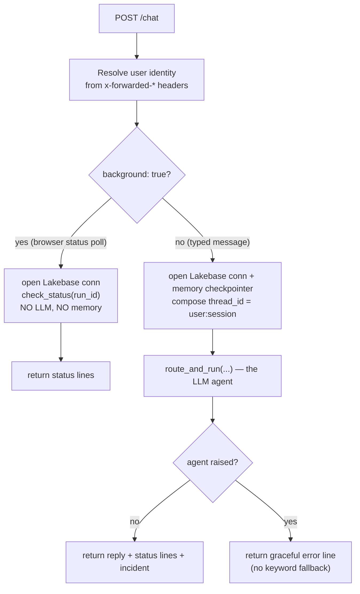
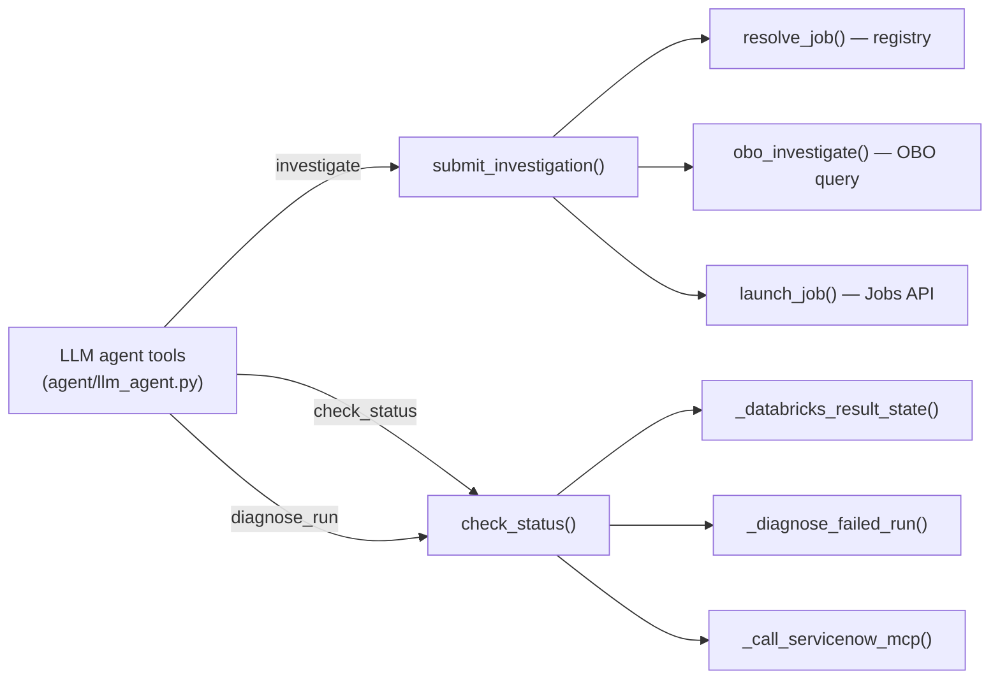

# 03 · The Orchestrator App

**Files:** `agent/app.py`

This is the front door and the coordinator. `agent/app.py` is a FastAPI app that
serves the chat UI, owns the `/chat` endpoint, resolves who's asking, runs the LLM
agent, and holds all the **trusted server-side logic** the agent's tools call back
into (launching jobs, reading status, filing incidents). At ~860 lines it's the
largest file in the project, so this section maps its structure first, then walks
the one request flow that ties everything together.

> The app is started by `uvicorn agent.app:app` (from `resources/apps.yml`) — i.e.
> the `app` object defined near the bottom of `agent/app.py`.

## How the file is laid out

Read it top to bottom in these bands:

| Lines (approx.) | Band | What it does |
|---|---|---|
| imports + config | **Configuration** | Env vars, and `enable_tracing()` runs at import |
| `_lakebase_token` → `lakebase_checkpointer` | **Lakebase connections** | Per-request DB connections + the memory checkpointer |
| `_mcp_auth_headers` → `_call_servicenow_mcp` | **ServiceNow filing** | The MCP client (wire handshake + stub fallback) |
| `obo_investigate` | **Identity (OBO)** | The as-the-user warehouse query |
| `launch_job` → `check_status` | **Async orchestration** | The coordinator functions (the heart) |
| `app` + `_CHAT_HTML` + routes | **FastAPI surface** | The two endpoints + the inline chat UI |

Most bands are covered in depth in another section; this one explains how they fit
together and owns the request flow and the coordinator functions.

## Configuration

The top of the file reads everything from environment variables — warehouse id,
the auth-events table, the Lakebase endpoint/host, the MCP app URL. Each has a
hard-coded default as a fallback, but in production those come from the bundle
([Setup](01-setup.md)).

> The fallback default values (a specific Lakebase host, a `PGUSER`, an
> `AUTH_TABLE`) are **workspace-specific** — they'd be parameterized before reuse.
> Treat the env vars as the real source; the defaults just keep local runs from
> crashing on a missing variable.

`enable_tracing()` is called once at import ([tracing](02-llm-agent.md)) — it's
non-fatal, so a tracing misconfiguration never stops the app from booting.

## The two endpoints

```python
@app.get("/",  response_class=HTMLResponse)   # serves the inline chat UI
@app.post("/chat")                            # the one functional endpoint
```

`GET /` returns a single self-contained HTML page (`_CHAT_HTML`). `POST /chat` does
all the real work. There is no other route — the app is deliberately just a chat
surface plus one endpoint.

## The `/chat` request lifecycle

This is the flow to internalize. `chat()` handles two very different kinds of
request, distinguished by the `background` flag on the request body:



### 1. Identity

`user_identity(dict(request.headers))` ([Identity &
passthrough](04-identity-and-passthrough.md)) pulls the caller's email from the
`x-forwarded-email` header that [Databricks Apps](https://docs.databricks.com/aws/en/dev-tools/databricks-apps) injects. Locally those headers are
absent, so it falls back to a `LOCAL_USER`. The forwarded `x-forwarded-access-token`
is also captured here — that's the token used later for the on-behalf-of warehouse
query.

### 2. The `background` branch — a pure status read

When the browser's poller pings (`background: true`), the handler answers *directly*
from `check_status`: it opens one Lakebase connection, reads the run's current
state, and returns. **No LLM call, no memory.** This is what keeps polling cheap and
keeps the conversation history limited to the user's actual typed turns (the silent
polls don't pollute memory).

### 3. The main branch — the LLM agent with memory

For a real typed message the handler:
1. opens a Lakebase connection for the **status store** (`PostgresStatusStore`),
2. opens a second connection for the **memory checkpointer**
   (`lakebase_checkpointer()`), guarded so that if memory is unavailable the turn
   still runs statelessly,
3. composes a `thread_id` from `user_id` + `session_id` (so each browser
   conversation is its own memory thread),
4. **opens a turn** for observability — `store.open_turn(...)` inserts an `open` row
   in the `turns` table, and
5. calls `route_and_run(...)` — the LLM agent ([section 02](02-llm-agent.md)).

If the agent raises for any reason (e.g. the model endpoint is down), the handler
returns a **graceful error line** — there is deliberately *no* deterministic keyword
fallback. The LLM agent is the only path.

Once the request finishes — success *or* graceful error — the handler
**closes the turn** (`store.close_turn(...)`, flipping the row to `closed`). Only a
request that never returns (a crash, a timeout kill) leaves its turn `open`, which
the scheduled [sweeper job](01-setup.md) later marks `abandoned`. Both the open and
close are best-effort, so turn tracking never breaks a chat turn.

Both connections are closed in a `finally`, always.

## The connection model (why two connections per request)

Lakebase credentials are short-lived (≈1h), so the app **never holds a pooled
connection**. `lakebase_conn()` is a *factory*: every call mints a fresh OAuth token
via the Databricks SDK and opens a new psycopg connection. A request opens two — one
for the status store, one for the checkpointer — because the checkpointer needs
`autocommit=True` (LangGraph's `setup()` runs `CREATE INDEX CONCURRENTLY`, which
can't run inside a transaction) while the status store uses normal transactions.
Mixing them on one connection would fight over transaction state.
[State & memory](02-llm-agent.md) covers the schema and the dedicated `agent_memory`
schema; for now just note the pattern: **fresh token, new connection, closed at end
of request.**

## The coordinator functions (the trusted core)

Here's the architectural key to the whole app: **`app.py` holds the trusted
server-side operations, and the LLM agent ([section 02](02-llm-agent.md)) merely
exposes them as tools.** The model decides *what* to do; these functions decide
*how*, safely.



### `submit_investigation()` — non-blocking launch

1. Resolve the workflow from the governed registry (`get_registry` + `resolve_job`,
   [the job registry](02-llm-agent.md)). If the registry is unavailable, it returns
   a graceful error dict and launches nothing — the registry is a hard prerequisite.
2. Optionally run the **on-behalf-of** auth-log query ([Identity &
   passthrough](04-identity-and-passthrough.md)) to add a real, user-authorized
   finding line to the reply.
3. `launch_job(...)` records the run as `queued` and triggers the job.
4. Return the `run_id` immediately with a "started on serverless — ask me for
   status" line. **It never waits for the job to finish.**

### `launch_job()` — trigger the workflow

Upserts a `queued` status row, then either calls `jobs.run_now(job_id, …)` as the
app service principal (passing identity + params as `python_params`, [Setup, Part
B](01-setup.md)) and captures the Databricks run id, or — when no `job_id` is given
(local dev) — runs the job inline in a daemon thread with its own Lakebase
connection.

### `check_status()` — status on demand, and the terminal-state side effects

This is where the async pattern closes. On each call it reads the run and reports
its stage. Two important things happen only on the transition to a terminal state,
each guarded by an **atomic claim** so concurrent callers (a foreground "why did it
fail?" racing the 5-second background poller) can't double-act:

- **Failure →** detect it (either the job self-reported `failed`, or the Databricks
  run's `result_state` is `FAILED`/`INTERNAL_ERROR`/`TIMEDOUT`), claim the diagnosis
  slot, and generate a grounded diagnosis ([failure diagnosis](02-llm-agent.md)). A
  transient diagnosis failure is *not* cached — the claim is released so a later poll
  retries.
- **Completion →** claim the incident slot and file the ServiceNow incident
  ([Identity & passthrough](04-identity-and-passthrough.md)) from the run's *own*
  findings, for the host the run actually investigated, attributed to the user. The
  result (findings + incident) is cached so repeat checks don't re-file.

`_databricks_result_state()` and `_diagnose_failed_run()` are the small helpers this
uses; `format_status_message` / `select_findings` come from `agent/graph.py`
([the LLM agent](02-llm-agent.md)).

## The inline chat UI (`_CHAT_HTML`)

The entire front end is one HTML string served by `GET /`. It's plain HTML/CSS/JS,
no build step. The parts worth knowing:

- **Rendering (`agentHtml`)** — splits the reply into lines; a line like
  `[obo] queried …` becomes a colored "investigation-log" line whose tag
  (`queued`/`running`/`done`/`failed`/`diagnosis`) conveys state, and other lines
  render as prose with minimal inline markdown (`**bold**`, `*italic*`, `` `code` ``).
  Everything is HTML-escaped *first* — the `[diagnosis]` text derives from job logs
  (untrusted), so it must never be treated as HTML.
- **Session** — a `session_id` is generated and stored in `localStorage`, sent on
  every message so the server keys memory to this browser conversation. "New
  conversation" mints a fresh one.
- **Background polling** — after a run is queued, the page polls `/chat` with
  `background: true` every 5 s, stays silent while the run is `running`, and
  auto-posts a "🔔 Update" bubble (and the incident card) when it reaches
  `complete`/`failed`.
- **Incident dedup** — an incident can arrive via both the foreground reply and the
  poller; `renderIncident` shows each incident number at most once.

## Request/response contract

`POST /chat` accepts `{message, run_id, host, session_id, background}` and returns a
JSON object: `status_lines` (the lines the UI renders), plus `run_id`, `host`,
`stage`, `intent`, `user_id`, and an optional `incident`. The client keys off
`stage` (`queued` starts polling; `complete`/`failed` stop it) and `run_id`.
