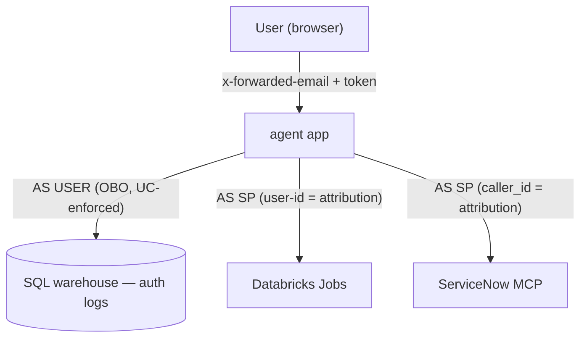
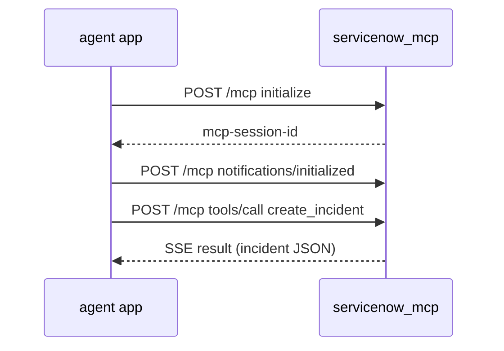

# 04 · Identity & Passthrough

This section covers two related things: the **identity model** — which calls run as
the user and which run as the app's [service principal](https://docs.databricks.com/aws/en/admin/users-groups/service-principals) — and the **ServiceNow MCP
app**, the external integration that the user's identity is *passed through* to.
Together they answer "who is each outbound call made as, and how does the user's
identity travel with it?"

---

# Part A — The identity model

This question comes up throughout the codebase: *which calls run as the user, and
which run as the app's service principal?* This is the definitive answer, and it's
the most important architectural idea in the project.

The one-sentence version: **[on-behalf-of (OBO)](https://docs.databricks.com/aws/en/dev-tools/databricks-apps/auth) is used only for the SQL-warehouse
query; jobs and the MCP call run as the app service principal, with the user's
identity passed along only as attribution.**

## Where identity comes from

A Databricks App sits behind a proxy that authenticates the user and injects two
headers:

- **`x-forwarded-email`** — who the user is.
- **`x-forwarded-access-token`** — the user's access token, downscoped to the scopes
  the app declares (`user_api_scopes: [ai-gateway, sql]`, [Setup](01-setup.md)).

`agent/obo.py` `user_identity(headers)` reads the email (falling back to
`x-forwarded-user`, then `"unknown"`). `/chat` captures both the email and the token
at the top of the handler ([orchestrator app](03-orchestrator-app.md)). Everything
downstream is one of these identities.

> `obo.py` also defines `get_user_client()`, a convenience wrapper for a per-user
> client. The live OBO path doesn't use it — it constructs its client directly
> (below) — so `user_identity` is the function that actually matters here.

## The one true OBO: the SQL-warehouse query

`obo_investigate(host, user_token)` is the only place the code acts **as the user**.
It builds a client from the forwarded token and runs the auth-log query through it:

```python
user_cfg = Config(host=host_url, token=user_token, auth_type="pat")
user_wc  = WorkspaceClient(config=user_cfg)
investigate(host, execute_sql=sdk_sql_executor(user_wc, WAREHOUSE_ID), table=AUTH_TABLE)
```

Two details make this real, platform-enforced OBO:

- **`auth_type="pat"` is required.** The Apps runtime injects the SP's
  `DATABRICKS_CLIENT_ID`/`SECRET` into the environment. Without pinning the auth
  type, the SDK sees *two* credentials (SP creds + the forwarded token) and errors
  with "more than one authorization method configured." Pinning `pat` forces it to
  use the user's token.
- **[Unity Catalog](https://docs.databricks.com/aws/en/data-governance) enforces the user's grants.** The query authenticates as the user,
  so `current_user()` is the user, not the SP — if the user isn't allowed to read the
  auth table, the query fails. This is genuine authorization, not a label. The `sql`
  scope in `user_api_scopes` is what makes the forwarded token usable against the
  warehouse.

## Everything else runs as the service principal

| External call | Runs as | How | User identity is… |
|---------------|---------|-----|-------------------|
| **Auth-log query** (SQL warehouse) | **the user** (OBO) | forwarded token, `auth_type="pat"` | **authorization** — UC-enforced |
| **Jobs API** (`run_now`, `get_run`, logs) | **app SP** | bare `WorkspaceClient()` | **attribution** — passed as `--user-id` |
| **ServiceNow MCP** | **app SP** | `WorkspaceClient().config.authenticate()` | **attribution** — passed as `caller_id` |

- **Jobs** — `launch_job` calls `jobs.run_now(...)` with a plain `WorkspaceClient()`
  (the SP), and the failure-log fetch ([failure diagnosis](02-llm-agent.md)) uses the
  SP too. There is **no Jobs-API OBO scope** — you cannot launch or inspect a job "as
  the user." The user's email rides along as the `--user-id` python param so the run
  records who asked.
- **MCP** — `_mcp_auth_headers()` authenticates with the SP's own credentials; the
  originating user's email is passed as `caller_id` so the ServiceNow incident is
  attributed to them (Part B below).

## Attribution vs. enforcement — the honest model

The distinction that ties it together:

- **Authorization** means the platform *enforces* the identity. Only the SQL query
  has this — Unity Catalog checks the user's grants.
- **Attribution** means the identity is *recorded* but not enforced. The job and the
  incident carry the user's identity as a parameter for audit, but the actual
  permissions used are the SP's.

This is a deliberate, honest design: use real OBO where the platform supports it
(SQL / Unity Catalog), and fall back to attribution where it doesn't (Jobs, MCP).
It's the same tension flagged in [Setup, Part B](01-setup.md)'s "scale and identity"
note and the registry's `requires_approval`/`allowed_groups` (which aren't enforced)
— per-user *authorization* for the job path isn't something the platform hands you
for free; you'd enforce it in-app (or scope the SP-run work using the user-authorized
read) if you needed it.

## The end-to-end picture



Read the arrows as the whole identity model: exactly one runs as the user; the other
two run as the service principal and merely *carry* the user's identity.

---

# Part B — The ServiceNow MCP app

This is the **second Databricks App** in the bundle. It's a small, standalone **MCP
server** that exposes one tool — filing a ServiceNow incident — to the orchestrator.
It exists as its own app to model a real pattern: the integration with an external
system (ServiceNow) lives behind a Model Context Protocol server, separate from the
agent that calls it.

## What MCP is here

The Model Context Protocol is a standard way to expose tools to an agent/client.
This server speaks MCP over HTTP using FastMCP's **streamable-HTTP** transport, so
the orchestrator talks to it over the network like any other service — but through
the MCP handshake rather than a bespoke REST contract.

## The server (`server.py`)

Small and declarative:

- **`mcp = FastMCP("servicenow-mcp")`** and one decorated tool:
  ```python
  @mcp.tool()
  def create_incident(short_description, description, caller_id) -> dict:
      ...
  ```
  That's the entire tool surface — create an incident, attributed to `caller_id`.
- **`build_backend(env)`** picks the implementation from `SERVICENOW_BACKEND`:
  `"rest"` → the real ServiceNow Table API, anything else → the in-memory stub (the
  default).
- **Dual-mode import** — it imports the backend as either `servicenow_mcp.backend`
  (when run as a package, e.g. by tests) or `backend` (when this file is the deployed
  app's entrypoint, run from inside its own source dir). This is why the app can
  deploy from its own nested directory ([Setup](01-setup.md)).
- **`mcp.run(transport="streamable-http")`** is the entrypoint; it binds `0.0.0.0` on
  the Apps port via `FASTMCP_HOST`/`FASTMCP_PORT` env.

## The backend (`backend.py`) — stub vs. real

A `ServiceNowBackend` `Protocol` with a single `create_incident` method, and two
implementations:

- **`StubBackend`** (the default) — in-memory, no external calls. It returns a
  realistic-looking incident record (`{"number": "INC00420xx", "sys_id": …,
  "caller_id": …, "state": "New"}`) and **echoes the caller** so attribution is
  visible. This is what the demo runs.
- **`RestBackend`** — the real ServiceNow Table API: it `POST`s to
  `/api/now/table/incident` with a `Bearer` token from a `token_provider`. The
  provider (`_obo_token`) reads `SERVICENOW_OBO_TOKEN` — the hook for calling
  ServiceNow as the requesting user when a real instance is configured. In stub mode
  this path isn't exercised.

Swapping to the **single-token** REST path is config-only (`SERVICENOW_BACKEND=rest`
plus the instance URL and a token; no code change). **Per-user OBO** to ServiceNow keeps
the agent → MCP call **direct** (so the app sees the user via `x-forwarded-*`) and adds a
UC HTTP Connection **to ServiceNow** whose per-user token is wired into `_obo_token()`.
Registering the app as an AI Gateway MCP Service is a **parallel governance** layer — with
an M2M connection it presents a shared service principal, *not* the end user, so it isn't
the per-user identity path. See
[Connecting a real ServiceNow instance](servicenow-connect.md).

## How the orchestrator calls it

The client side lives in `agent/app.py` ([orchestrator
app](03-orchestrator-app.md)). `_call_servicenow_mcp` runs the full MCP
streamable-HTTP handshake, then falls back gracefully:



- **Three-step handshake** — `initialize` (capture the `mcp-session-id` header), the
  `notifications/initialized` ack, then `tools/call create_incident`. The response is
  a `text/event-stream`, which `_parse_mcp_sse_result` decodes.
- **Graceful fallback** — if `SERVICENOW_MCP_URL` is unset, or the wire call fails
  for any reason, `_call_servicenow_mcp` uses an **in-process `StubBackend`** instead.
  So incident filing never hard-fails the request, and the whole thing runs locally
  with no second app.
- **Called as the service principal** — `_mcp_auth_headers()` authenticates with the
  app SP's own credentials, and the user's email is passed as `caller_id`
  (attribution, not enforcement — Part A above).

## Deploy & config

- Deployed from its **own nested source dir** (`source_code_path: ../servicenow_mcp`,
  [Setup](01-setup.md)), with its own pinned `requirements.txt` (`mcp`, `httpx`).
- Env: `SERVICENOW_BACKEND=stub`, `FASTMCP_HOST=0.0.0.0`, `FASTMCP_PORT=8000`.
- The orchestrator finds it via the `SERVICENOW_MCP_URL` env var, and the app SP needs
  `CAN_USE` on this app ([Setup, Part C](01-setup.md)).

## Why it's a separate app

Two reasons this isn't just a function in the orchestrator:

1. **It models the real integration boundary** — the external-system connector is an
   independent, separately-deployable MCP server the agent calls over the network,
   which is how you'd structure a real multi-system agent.
2. **It's swappable** — anything that speaks MCP `create_incident` can stand in, and
   the orchestrator's graceful fallback means the demo still works if the MCP app is
   down or absent.
