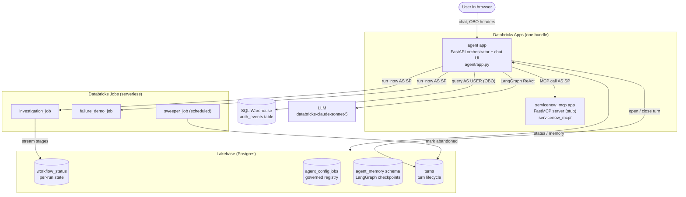
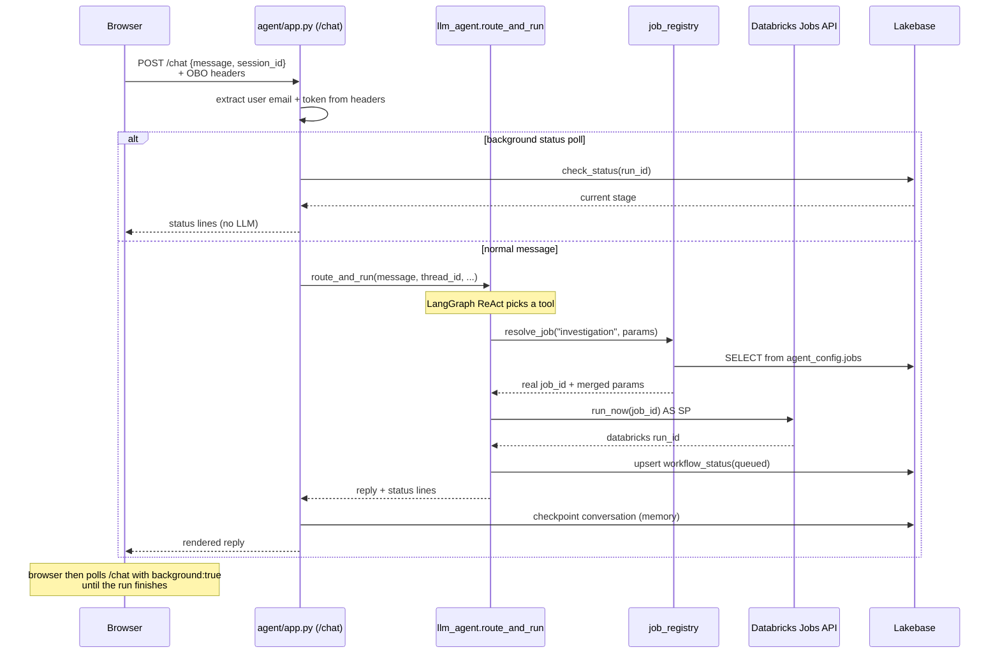

# Codebase Walkthrough

A guided tour of this project, grouped into five sections. This page is the map —
what the system is, how a request flows through it, and where to read next.

| Section | Covers |
|---------|--------|
| [01 · Setup](01-setup.md) | What you set up around the agent — the bundle/deploy, the jobs it triggers, and the prerequisites you provision |
| [02 · The LLM agent](02-llm-agent.md) | The agent and everything it directly uses: the ReAct core, the job registry, state & short-term memory, failure diagnosis, and tracing |
| [03 · The orchestrator app](03-orchestrator-app.md) | The FastAPI front door: the `/chat` request lifecycle and the inline chat UI |
| [04 · Identity & passthrough](04-identity-and-passthrough.md) | The on-behalf-of model, and the ServiceNow MCP app that incidents are filed through |
| [05 · Tests & eval](05-tests-and-eval.md) | The offline test suite and the real-model routing eval |

> For the terse reference version of this same material, see
> [`CLAUDE.md`](../CLAUDE.md) in the repo root.

## What this project is

A **conversational security-investigation agent**, hosted entirely on
Databricks. A user chats with it ("investigate web-prod-04"); the agent:

1. queries the auth-event logs **as that user** (Unity Catalog enforces what
   they're allowed to see),
2. launches a **long-running Databricks Job** to do the heavy investigation,
3. streams the job's status back into the chat without blocking,
4. **diagnoses** the failure if a run fails, and
5. files a **ServiceNow incident** for a completed investigation.

The concrete scenario is security-log investigation, but the architecture is a
general template for **any LLM agent that governs and triggers real backend
workflows**: swap the tools and the job logic and the same shape applies.

## New to Databricks? Docs for the platform pieces

This project is built entirely from Databricks platform components. If any are
unfamiliar, here are the official docs for each — they're also linked inline where
each first comes up in the chapters.

| Component | What it does in this project |
|-----------|------------------------------|
| [Declarative Automation Bundles (DAB)](https://docs.databricks.com/aws/en/dev-tools/bundles) | Packages the two apps and the jobs as one deployable bundle ([01](01-setup.md)) |
| [Databricks Apps](https://docs.databricks.com/aws/en/dev-tools/databricks-apps) | Hosts the FastAPI orchestrator and the ServiceNow MCP server ([03](03-orchestrator-app.md)) |
| [Databricks Apps — authorization](https://docs.databricks.com/aws/en/dev-tools/databricks-apps/auth) | On-behalf-of (OBO) user identity for the app ([04](04-identity-and-passthrough.md)) |
| [Lakeflow Jobs](https://docs.databricks.com/aws/en/jobs) | The serverless jobs the agent triggers ([01](01-setup.md)) |
| [Lakebase (Postgres)](https://docs.databricks.com/aws/en/oltp/projects) | Per-run status, conversational memory, and turn tracking ([02](02-llm-agent.md)) |
| [Unity Catalog](https://docs.databricks.com/aws/en/data-governance) | Governs data access, the job registry, and the model service ([04](04-identity-and-passthrough.md)) |
| [Foundation Model APIs / Model Serving](https://docs.databricks.com/aws/en/machine-learning/model-serving/foundation-model-overview) | Serves the Claude Sonnet 5 model the agent calls ([02](02-llm-agent.md)) |
| [Unity AI Gateway](https://docs.databricks.com/aws/en/ai-gateway) | Governs the agent's model calls ([02](02-llm-agent.md)) |
| [MLflow Tracing](https://docs.databricks.com/aws/en/mlflow3/genai/tracing) | Observability for each LLM and tool call ([02](02-llm-agent.md)) |
| [SQL Statement Execution API](https://docs.databricks.com/aws/en/dev-tools/sql-execution-tutorial) | Runs the on-behalf-of auth-log query on a SQL warehouse ([04](04-identity-and-passthrough.md)) |
| [Service principals](https://docs.databricks.com/aws/en/admin/users-groups/service-principals) | The app's non-human identity, used for jobs and the MCP call ([04](04-identity-and-passthrough.md)) |
| [Managed MCP servers](https://docs.databricks.com/aws/en/agents/mcp-tools/managed-mcp) | Databricks' Model Context Protocol support ([04](04-identity-and-passthrough.md)) |

## The mental model in one sentence

> A **FastAPI app** hosts an **LLM agent** that can call three **governed
> tools**; the tools trigger and poll **Databricks Jobs** and read/write
> **Lakebase (Postgres)**; a **second app** exposes a **ServiceNow MCP** server.

Everything else is detail hanging off that sentence.

## Runtime topology

Two Databricks Apps and three Jobs, all defined in one Declarative Automation Bundle:

Two things to notice up front, because they shape the whole design:

- **The agent app is the only thing the user talks to.** Everything else (jobs,
  MCP, Lakebase, warehouse) is reached *by the app on the user's behalf*.
- **Identity splits in two.** The warehouse query runs as the *real user*
  (true on-behalf-of). Jobs and the MCP call run as the *app's service
  principal*, with the user's identity passed along only as an attribution
  parameter. [Identity & passthrough](04-identity-and-passthrough.md) is entirely
  about why.

## The components (and which section owns each)

| Component | What it does | Section |
|-----------|--------------|---------|
| **`agent` app** (`agent/app.py`) | FastAPI orchestrator; serves the chat UI, owns `/chat`, extracts identity, calls the agent, talks to Lakebase/jobs/MCP | [03](03-orchestrator-app.md) |
| **LLM agent** (`agent/llm_agent.py`) | A LangGraph ReAct agent over Claude Sonnet 5 with three governed tools | [02](02-llm-agent.md) |
| **Job registry** (`agent/job_registry.py`) | Resolves an LLM-chosen `job_key` to a real, admin-approved `job_id` | [02](02-llm-agent.md) |
| **Jobs** (`jobs/*.py`) | The actual serverless workloads the app triggers | [01](01-setup.md) |
| **State & memory** (`status_store.py`, `common/`) | `workflow_status` per-run store + conversational checkpointer | [02](02-llm-agent.md) |
| **Diagnosis** (`agent/diagnosis.py`) | Grounds an LLM explanation on a failed run's error log | [02](02-llm-agent.md) |
| **Identity/OBO** (`agent/obo.py`) | The on-behalf-of warehouse query; the identity model | [04](04-identity-and-passthrough.md) |
| **ServiceNow MCP** (`servicenow_mcp/`) | A second app serving an MCP tool server (stub backend) | [04](04-identity-and-passthrough.md) |
| **Tracing** (`agent/tracing.py`) | Logs LangGraph traces to an MLflow experiment | [02](02-llm-agent.md) |

## The request lifecycle (the one flow to internalize)

When a user sends a chat message, here's the end-to-end path. Follow it once and
the rest of the codebase falls into place.

The key insight: **launching is non-blocking**. The agent starts a job and
returns a run id immediately; the browser polls in the background; the finished
result (and any ServiceNow incident) shows up in a later poll. The
`background: true` branch is a pure status read — no LLM, no memory — which is why
it's fast and cheap to poll.

## Suggested reading order

Read the sections in order the first time. [Setup](01-setup.md) frames the
infrastructure and workloads that exist around the agent; [The LLM
agent](02-llm-agent.md) is the brain and everything it uses; [The orchestrator
app](03-orchestrator-app.md) is the front door that drives it; [Identity &
passthrough](04-identity-and-passthrough.md) is the cross-cutting identity model;
and [Tests & eval](05-tests-and-eval.md) closes out. After the first pass they
stand alone.
