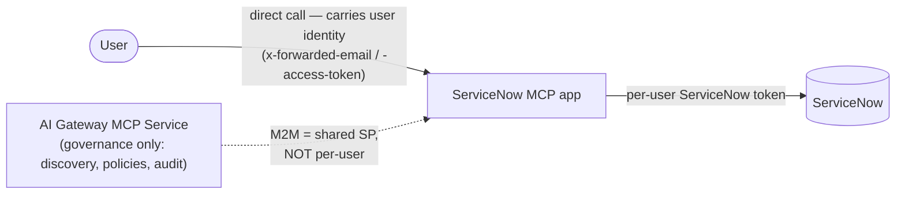

# Connecting a real ServiceNow instance

By default the ServiceNow MCP app runs a **stub** backend: it accepts the tool
call, echoes the authenticated caller, and returns a fake incident number. That's
enough to prove the whole flow — investigate → status → **human approval** →
"incident filed as the user" — without any ServiceNow at all.

This guide is for the step you do once you *have* ServiceNow: pointing the MCP at a
real instance so incidents are created there, ideally **as the calling user**.

## The two hops

Identity reaches ServiceNow in two hops. The stub proves hop A today; this guide
completes hop B.

- **Hop A** (user → MCP) is Databricks-native and already works: the orchestrator
  passes the originating user through, and the incident is attributed to them
  (`caller_id`). See [Identity & passthrough](04-identity-and-passthrough.md).
- **Hop B** (MCP → ServiceNow) is what you wire up here. The recommended form is
  **per-user OBO**: each user's Databricks identity is exchanged for a short-lived
  ServiceNow token, so the incident is created *as that user* — the auditing and
  access-control story ServiceNow customers want.

## Do you need to register the MCP with Unity AI Gateway?

Registering the MCP app as a **Unity Catalog MCP Service** is **not required for the
agent to work** — the orchestrator calls the MCP app directly today, and the
**human approval gate is enforced in the app**, not the gateway. What registration
adds is **governance**: gateway usage tracking, payload logging, Service Policies
(allow / deny / **ask** on the write), tool discovery in Unity Catalog, and unified audit.

**But registration is *not* the per-user identity path — and this is verified, not
assumed.** With an **OAuth M2M** connection the gateway → app hop authenticates as **one
shared service principal**: a header check on the live app showed that a call routed
*through the gateway* arrives with `x-forwarded-email` = the **service principal**, while
the **direct app call** arrives with the **real user** (`x-forwarded-email` +
`x-forwarded-access-token`). So a per-user write routed through the M2M gateway would file
**every** incident as that one service account.

> **Rule of thumb:** register the MCP Service for **governance**, but keep the
> agent → MCP call **direct** (`SERVICENOW_MCP_URL` = the app URL) for **per-user
> identity**. An M2M gateway connection *cannot* carry the end user; a **U2M-per-user**
> gateway connection *can* — but confirm that with a header check before relying on it.

> **First principle:** Databricks on-behalf-of gives your app a **Databricks** user
> token — that is **not** a ServiceNow token. Something in the chain must exchange it
> for a **per-user ServiceNow** OAuth token. *Where* you do that is the choice below.

## Paths

| Path | Incident filed as | You own | Use when |
|------|-------------------|---------|----------|
| **A. Single service token** | one service account | just config | a fast "it really hit ServiceNow" demo |
| **B1. Per-user OBO — managed** (app → ServiceNow via UC HTTP Connection) | the actual user | grants + connection; Databricks owns the OAuth | you want managed tokens, least app-side secret handling |
| **B2. Per-user OBO — custom** (the MCP does its own OAuth) | the actual user | the ServiceNow OAuth code | you can't/don't want the managed connection path |

> **What's implemented today:** the MCP's REST call uses a bearer token from
> `_obo_token()`, which returns the static `SERVICENOW_OBO_TOKEN` — i.e. **Path A**.
> B1 and B2 are the *recommended architecture to finish*, not a config-only flip.
> Because **ServiceNow does not require the RFC 8707 `resource` parameter**, the managed
> UC-Connection path (**B1**) is unblocked and is the one to reach for.

---

## Path A — single service token (quickest)

1. In ServiceNow, get an API token (or basic-auth-derived bearer) for a service
   account that can create incidents.
2. Set the MCP app's environment. For the **bundle-deployed** app, edit the
   `servicenow_mcp` app's `config.env` in **`resources/apps.yml`** — that is the env
   the deploy applies (the source `servicenow_mcp/app.yaml` is only for standalone/
   local runs). The commented block there shows exactly where:
   - `SERVICENOW_BACKEND=rest`
   - `SERVICENOW_INSTANCE=https://<your-instance>.service-now.com`
   - `SERVICENOW_OBO_TOKEN=<the service-account token>`
3. Redeploy the MCP app: `databricks bundle deploy` then `databricks bundle run servicenow_mcp`.

Every incident is now created in your instance — but all as the one service
account. Honest framing: this proves the REST integration, **not** per-user OBO.

---

## Path B — per-user OBO: file the incident as the actual user

**Architecture.** Keep the agent calling the MCP app **directly** (so the app receives
the user via `x-forwarded-*`), and add a **second** connection for the **app → ServiceNow**
hop that yields a **per-user ServiceNow token**. If you register the app as an MCP Service,
that registration is a **parallel governance layer** over the gateway → app hop — it is
**not** in this write path (with M2M it presents a shared service principal, not the user).

> **The code gap either way:** the REST backend calls ServiceNow with the token from
> `_obo_token()`, which today only reads the static env var. For per-user OBO it must
> return the **caller's** ServiceNow token *for the current request*. Until wired, the
> REST backend **fails fast** rather than sending an empty bearer.

### B1 — managed (recommended)

Databricks holds the ServiceNow OAuth grant and injects each caller's downscoped token;
the app never stores long-lived ServiceNow secrets.

**1. Register an OAuth app in ServiceNow** *(ServiceNow admin)*
In **System OAuth → Application Registry**, create an OAuth API endpoint for an external
client. Record the **client id/secret**, **authorization** and **token** endpoints, set
the redirect URL Databricks gives you, and grant the scope needed to create incidents.

**2. Create a Unity Catalog HTTP Connection to ServiceNow (`OAUTH_U2M` per-user)** *(Databricks)*
Create a UC **HTTP Connection** whose target is **your ServiceNow instance** (not the app),
using **per-user OAuth (U2M)**, with the client id/secret + endpoints from step 1. Databricks
stores the grant and, at call time, retrieves and injects the per-user credential — secrets
stay in UC. See [Connect to external HTTP services](https://docs.databricks.com/aws/en/query-federation/http).

**3. Keep the call direct + wire the token** *(this repo)*
- **Leave `SERVICENOW_MCP_URL` = the app URL** (in `resources/apps.yml`). **Do not repoint
  to the gateway MCP-service path** — the M2M hop strips the user to the shared service
  principal (verified), so per-user filing would break.
- The app already reads the user from `x-forwarded-email` / `x-forwarded-access-token` on the
  direct call — that is the identity it acts as.
- Make `RestBackend` call ServiceNow **through the UC HTTP Connection as the user**, and have
  `_obo_token()` (or the backend) return the **per-user ServiceNow token UC injects** for the
  current request, instead of the static `SERVICENOW_OBO_TOKEN`.
- Set `SERVICENOW_BACKEND=rest` and `SERVICENOW_INSTANCE=https://<your-instance>.service-now.com`
  in **`resources/apps.yml`** (the `servicenow_mcp` app's `config.env`, which the bundle deploys
  — not `servicenow_mcp/app.yaml`), and redeploy.

**4. Grants + consent** *(Databricks)*
Grant demo users access to invoke the UC connection. The user's first incident triggers a
one-time ServiceNow OAuth consent; tokens mint and refresh thereafter.

**5. Verify.** Investigate → the agent **proposes** and waits → **Approve & file** → open the
incident in ServiceNow: `opened_by` reflects the actual user. (`caller_id` is a reference field
/ sys_id; if you passed an email you may need a `sys_user` lookup to resolve it, or `caller` can
land unset even though the request authenticated as the user.)

### B2 — custom (the MCP owns the ServiceNow OAuth)

Use this when you can't use the managed connection path. The MCP performs the ServiceNow OAuth
itself:

1. Ensure the app receives authenticated Databricks context — i.e. keep the **direct** call so
   `x-forwarded-*` arrives.
2. In the MCP server, run **ServiceNow OAuth U2M per user** (consent + token exchange).
3. Store the refresh/access token **server-side, keyed to the authenticated Databricks identity
   — never to a tool argument like `caller_id`** (which is caller-asserted).
4. `_obo_token()` returns that user's ServiceNow token; set `SERVICENOW_BACKEND=rest` +
   `SERVICENOW_INSTANCE` in `resources/apps.yml`, and redeploy.

You own the OAuth implementation and its security, but avoid the UC-connection OAuth layer.

### Governance (optional, parallel): register as an AI Gateway MCP Service

Registering the deployed app as an MCP Service adds tool discovery, **Service Policies**
(allow / deny / **ask** on `create_incident`), usage tracking, and unified audit — the
governance story. It's independent of Path B; keep the write on the direct call.

- Back it with a UC HTTP connection **to the app** (`…databricksapps.com/mcp`). With **OAuth
  M2M** it authenticates as **one shared service principal** — fine for governance, but it does
  **not** carry the end user (verified: `x-forwarded-email` = the service principal through the
  gateway). It is **not** the per-user identity path.
- Grant consumers **`EXECUTE` on the service** — **not** `USE CONNECTION` on the connection
  (that bypasses tool selection + policies) — plus `USE CATALOG` / `USE SCHEMA` to traverse to it.
- If you want per-user identity **and** gateway policies on the *same* call, use a **U2M-per-user**
  gateway connection (which can carry the user) instead of M2M — confirm it forwards the user with
  a header check first, then route the write through the gateway.
- [Connect agents to tools with MCP Services](https://docs.databricks.com/aws/en/agents/mcp-tools/mcp-services)
  · [Register an external MCP server](https://docs.databricks.com/aws/en/ai-gateway/register-mcp-service)

Creating the incident with the user's own token is the proof of end-to-end user identity to a
downstream system against a real external service.

---

## Notes

- Nothing here changes the agent or the approval gate — only the MCP's backend and
  how its token is sourced. The stub and the real paths present the identical
  `create_incident` contract, and the **app-level human-approval gate still guards the
  write** on every path (including the direct call, where gateway Service Policies don't apply).
- The MCP server code lives in `servicenow_mcp/` (`server.py`, `backend.py`); the
  backend switch is `SERVICENOW_BACKEND` (`stub` | `rest`).
- **The M2M gateway hop presenting a shared service principal (not the end user) is a
  verified finding**, not an assumption — a header check on the live app showed
  `x-forwarded-email` = the service principal through the gateway vs. the real user on the
  direct call. Re-verify with a header check if you switch the gateway connection to
  U2M-per-user.
- ServiceNow is **not** a Databricks *managed*-OAuth provider today, so a customer-owned
  UC HTTP Connection (B1) or app-side OAuth (B2) is the current path; a managed ServiceNow
  connector is on the roadmap.
