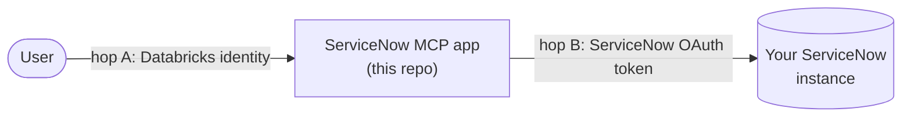

# Connecting a real ServiceNow instance

By default the ServiceNow MCP app runs a **stub** backend: it accepts the tool
call, echoes the authenticated caller, and returns a fake incident number. That's
enough to prove the whole flow — investigate → status → **human approval** →
"incident filed" — without any ServiceNow at all.

This guide is for the step you do once you *have* ServiceNow: pointing the MCP at a
real instance so incidents are created there, ideally **as the calling user**.

## The two hops

Identity reaches ServiceNow in two hops. The stub proves hop A today; this guide
completes hop B.

- **Hop A** (user → MCP): today the orchestrator calls the MCP as **its own service
  principal** and passes the originating user only as the `caller_id` tool argument
  (attribution, not identity). See [Identity & passthrough](04-identity-and-passthrough.md).
- **Hop B** (MCP → ServiceNow) is what you wire up here. The recommended form is
  **per-user OBO**: each user's Databricks identity is exchanged for a short-lived
  ServiceNow token, so the incident is created *as that user*.

## What files a ticket "as the actual user" (and what doesn't)

Who the MCP app sees as the caller depends entirely on **which identity the caller
authenticated as** — the Databricks Apps proxy forwards that as `x-forwarded-email` /
`x-forwarded-access-token`. Verified against the live app:

- a call routed **through the gateway** (with an **M2M** connection) arrives as the
  **connection's service principal**;
- a caller presenting a **user** OAuth token arrives as that **user**.

And how the agent calls the MCP **today**: the orchestrator authenticates the hop with
**its own service principal** (`_mcp_auth_headers()` → `WorkspaceClient().config.authenticate()`
in `agent/app.py`). So **today — on *both* the direct and the gateway paths — the MCP app
sees a service principal, not the end user**; the user travels only as `caller_id`.

> **Consequence:** filing "as the actual user" requires a deliberate change to *put the
> user's identity on the wire* — it does **not** happen for free on either path. The two
> ways to do it are **B1** (managed, via the gateway) and **B2** (custom, app-side) below.

> **First principle:** Databricks on-behalf-of gives your app a **Databricks** user
> token — that is **not** a ServiceNow token. Something in the chain must exchange it
> for a **per-user ServiceNow** OAuth token.

## Paths

| Path | Incident filed as | What you change | Use when |
|------|-------------------|-----------------|----------|
| **A. Single service token** | one service account | config only | a fast "it really hit ServiceNow" demo |
| **B1. Per-user — managed** (AI Gateway, U2M) | the actual user | U2M-per-user connection + route the call *through* the gateway + token wiring | you want Databricks-managed OAuth/refresh, no secrets in app code |
| **B2. Per-user — custom** (app-side OAuth) | the actual user | forward the user's token on the agent→MCP hop + app-side ServiceNow OAuth | you want it self-contained, no reliance on gateway injection |

> **What's implemented today:** the REST call uses `_obo_token()` → static
> `SERVICENOW_OBO_TOKEN` (**Path A**). B1/B2 are the architecture to finish (both need the
> customer's ServiceNow instance). ServiceNow **does not require the RFC 8707 `resource`
> parameter**, which removes the connection-layer blocker for the managed path (B1).

---

## Path A — single service token (quickest)

1. In ServiceNow, get an API token (or basic-auth-derived bearer) for a service
   account that can create incidents.
2. Set the MCP app's environment. For the **bundle-deployed** app, edit the
   `servicenow_mcp` app's `config.env` in **`resources/apps.yml`** — that is the env
   the deploy applies (the source `servicenow_mcp/app.yaml` is only for standalone/
   local runs):
   - `SERVICENOW_BACKEND=rest`
   - `SERVICENOW_INSTANCE=https://<your-instance>.service-now.com`
   - `SERVICENOW_OBO_TOKEN=<the service-account token>`
3. Redeploy the MCP app: `databricks bundle deploy` then `databricks bundle run servicenow_mcp`.

Every incident is now created in your instance — but all as the one service
account. Honest framing: this proves the REST integration, **not** per-user OBO.

---

## Path B — file the incident as the actual user

Today the agent→MCP hop is authenticated as the **orchestrator service principal**, so
the MCP app sees the SP and the user is only `caller_id`. Both routes below change that
so the incident is created as the real user. Both need the customer's ServiceNow
instance; pick based on where you want the OAuth to live.

> **The code gaps, by route:**
> 1. `_obo_token()` (in `servicenow_mcp/server.py`) must return the caller's per-user
>    ServiceNow token instead of the static env var — **both routes**.
> 2. For **B2**, the orchestrator must forward the **user's** `x-forwarded-access-token`
>    on the MCP call (change `_mcp_auth_headers()` / `_call_servicenow_mcp` in
>    `agent/app.py`) instead of using the app SP — otherwise the MCP app still sees the SP.

### B1 — managed (via the AI Gateway, U2M-per-user)

Databricks holds the ServiceNow OAuth grant and injects each caller's per-user token;
the app never stores long-lived secrets. **UC injects per-user credentials through a
governed surface (the AI Gateway MCP Service, or SQL `http_request`) — not on a bare
direct app call — so this route routes the write *through* the gateway.**

1. **Register an OAuth app in ServiceNow** *(ServiceNow admin)* — record client id/secret,
   authorization + token endpoints, the redirect URL Databricks gives you, and the scope
   to create incidents.
2. **Create a UC HTTP Connection to ServiceNow (`OAUTH_U2M` per-user)** *(Databricks)* with
   those creds. See [Connect to external HTTP services](https://docs.databricks.com/aws/en/query-federation/http).
3. **Register the MCP as an AI Gateway MCP Service backed by that connection, authentication
   U2M-per-user** *(Databricks)* — the gateway routes the caller's identity to the connection
   and injects the downscoped ServiceNow token.
   [MCP Services](https://docs.databricks.com/aws/en/agents/mcp-tools/mcp-services) ·
   [Register an external MCP server](https://docs.databricks.com/aws/en/ai-gateway/register-mcp-service)
4. **Route the agent through the gateway** *(this repo)* — set `SERVICENOW_MCP_URL` to the
   gateway MCP-service path (not the app URL), keep `user_api_scopes: [ai-gateway]` so the
   user token reaches the gateway, and wire `_obo_token()` to the injected per-user token.
   Set `SERVICENOW_BACKEND=rest` + `SERVICENOW_INSTANCE` in `resources/apps.yml`; redeploy.
5. **Grants + consent** — users need access to the MCP Service; the first incident triggers
   a one-time ServiceNow OAuth consent, then tokens mint/refresh.

> **Verify before building (unverified today):** confirm the gateway actually forwards/injects
> **per-user** identity with a header check. Our live test used an **M2M** connection and the
> gateway presented a **shared service principal** — the U2M-per-user behavior needs its own
> check before you rely on it.

### B2 — custom (app-side OAuth, forward the user token)

Self-contained; no reliance on gateway injection. The user's identity reaches the app on
the direct call, and the app runs ServiceNow OAuth itself.

1. **Forward the user token on the agent→MCP hop** *(this repo)* — change `_mcp_auth_headers()`
   / `_call_servicenow_mcp` in `agent/app.py` to send the caller's `x-forwarded-access-token`
   (the orchestrator already reads it for the SQL OBO) instead of the app SP's credentials, so
   the MCP app receives the real user via `x-forwarded-*`.
2. **Grant the *user* `CAN_USE`** on the MCP app (not only the orchestrator SP) — the
   forwarded-token call 403s otherwise.
3. In the MCP server, run **ServiceNow OAuth U2M per user** (consent + token exchange); store
   the token **server-side keyed to the authenticated Databricks identity — never to the
   `caller_id` tool argument** (which is caller-asserted).
4. `_obo_token()` returns that user's ServiceNow token; set `SERVICENOW_BACKEND=rest` +
   `SERVICENOW_INSTANCE` in `resources/apps.yml`; redeploy.

You own the OAuth implementation and its security, but avoid the UC-connection layer.

### Prerequisite for both (and for today's stub/Path A)

The **orchestrator app's service principal needs `CAN_USE` on the MCP app** — the wire call
is SP-authenticated today, and stays SP-authenticated for B1. (This grant is also listed in
the repo `CLAUDE.md`.) For **B2** you additionally grant the **user** `CAN_USE`.

### Governance (optional for B2): register as an MCP Service

Registering the app as an MCP Service adds tool discovery, **Service Policies**
(allow / deny / **ask** on `create_incident`), usage tracking, and unified audit.

- **B1 already registers it** (with a U2M connection) — that's how B1 carries identity.
- For **B2** (direct, app-side), you can register the app *additionally* for governance, but
  with an **M2M** connection it presents a **shared service principal** (verified — not the
  user), so an M2M registration is a **governance** layer only, not the identity path.
- Grant consumers **`EXECUTE` on the service** — **not** `USE CONNECTION` on the connection
  (that bypasses tool selection + policies) — plus `USE CATALOG` / `USE SCHEMA` to traverse to it.

Creating the incident with the user's own token is the proof of end-to-end user identity to a
downstream system against a real external service.

---

## Notes

- Nothing here changes the agent or the approval gate — only the MCP's backend, how its
  token is sourced, and (for B2) how the agent→MCP hop is authenticated. The stub and the
  real paths present the identical `create_incident` contract, and the **app-level
  human-approval gate still guards the write** on every path (including B2's direct call,
  where gateway Service Policies don't apply).
- The MCP server code lives in `servicenow_mcp/` (`server.py`, `backend.py`); the
  backend switch is `SERVICENOW_BACKEND` (`stub` | `rest`).
- **Verified finding:** the Databricks Apps proxy forwards *whatever identity the caller
  authenticated as*. A live header check showed the **M2M gateway** hop presenting the
  **connection's service principal**, and a **user-token** caller presenting the **user**.
  The current orchestrator→MCP call uses the **app SP** (`_mcp_auth_headers`), so it presents
  the SP too — that's why per-user filing needs B1 or B2, not just "call it directly."
- ServiceNow is **not** a Databricks *managed*-OAuth provider today, so a customer-owned
  UC HTTP Connection (B1) or app-side OAuth (B2) is the current path; a managed ServiceNow
  connector is on the roadmap.
